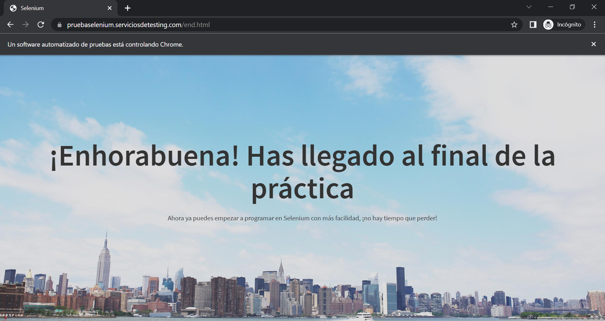

# selenium-tenlevelspractice

10 levels of Web testing automation based on Java and Selenium

## Application context

Selenium is an open-source tool that automates Web browsers. It provides a single interface that lets you write test scripts in programming languages like Java, among others.

## Complete the practice

In:

[tenlevelspractice\src\AllLevels.java](src/AllLevels.java)

```
	@Test
	public void test() throws InterruptedException {
		
		//Open URL
		driver.get("http://pruebaselenium.serviciosdetesting.com/");
		WebElement levelTitleElement=driver.findElement(levelTitle);
		
		//Level 1
		assertEquals(levelTitleElement.getText(),"Práctica Selenium");
		WebElement startButtonElement=driver.findElement(startButton);
		startButtonElement.click();
		levelTitleElement=driver.findElement(levelTitle);
		assertEquals(levelTitleElement.getText(),"Level 2");
		
		//Level 2

		//Level 3
		
		//Level 4
		
		//Level 5
		
		//Level 6
		
		//Level 7
		
		//Level 8
		
		//Level 9
		
		//Level 10

	}
```

## Practice solution

In:

[tenlevelspractice\src\AllLevelsSolution.java](src/AllLevelsSolution.java)



## Demo


## Deliverable

that includes:

1. Java EE Eclipse project with the source code. You should use Maven build because the project is clean.
2. A demo video.

Download the files as a zip using the green button, or clone the repository to your machine using Git.
